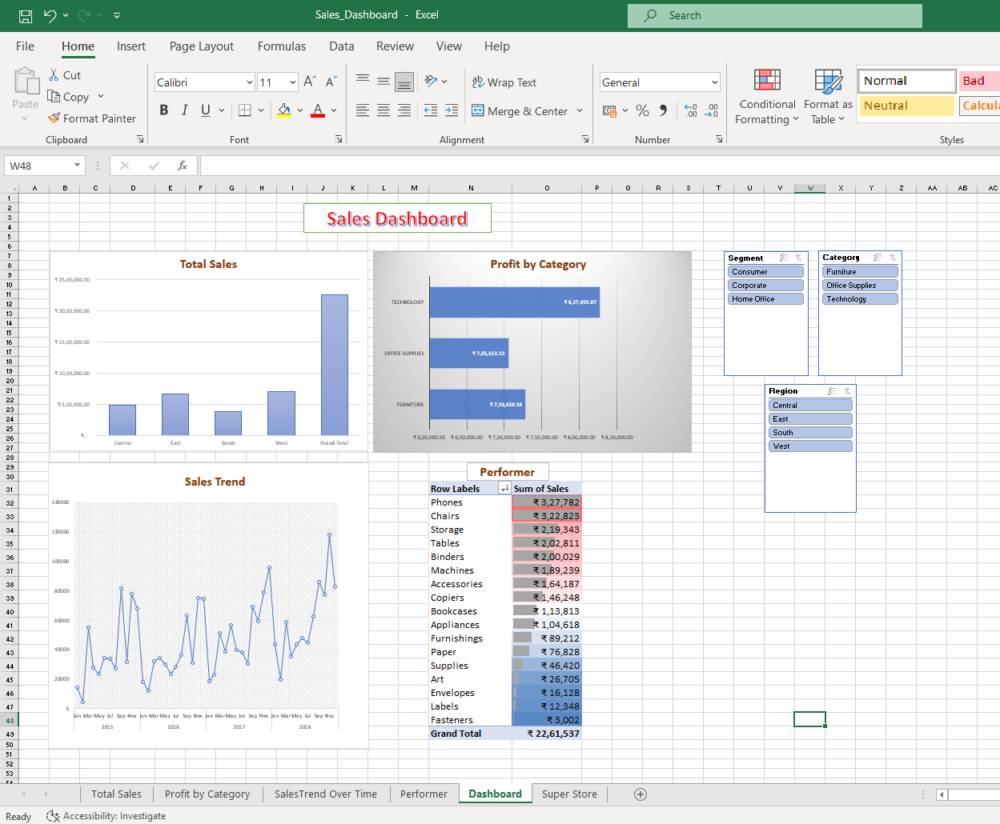

# 📈 Task 01 – Sales Dashboard

## Objective

Create an interactive Sales Dashboard using Microsoft Excel to analyze sales performance and business KPIs.

## Tools Used

- Microsoft Excel

## Features

- Sales KPI Cards
- Monthly Sales Trend
- Product Category Analysis
- Region-wise Performance
- Interactive Dashboard

## Dashboard Preview

## Files

- Sales_Dashboard.xlsx
- Dashboard_Screenshot.png

## Outcome

Developed an interactive dashboard that helps users monitor sales performance and make data-driven business decisions.
