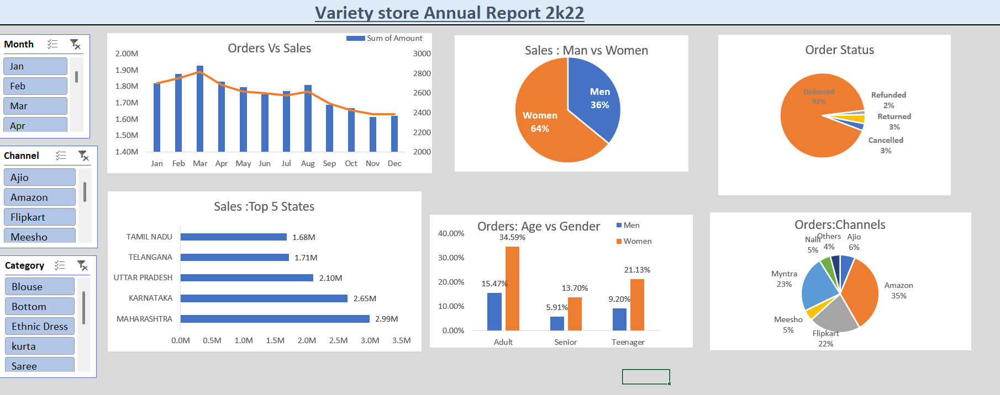

# 📉 Task 04 – Business Insights Report

## Objective

Analyze retail sales data and generate actionable business insights.

## Tools Used

- Microsoft Excel

## Analysis Performed

- Sales Performance Analysis
- Profit Analysis
- Customer Analysis
- Product Performance
- Business Recommendations

## Report Preview

## Files

- Variety Store Data Analysis.xlsx
- Business Insights Report.pdf
- Task4 Screenshot.png

## Outcome

Generated meaningful business insights to support strategic decision-making and improve business performance.
